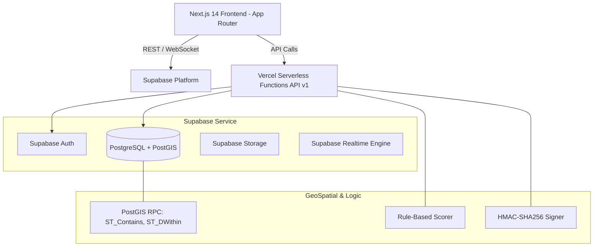

# Arsitektur Sistem UrbanLoad.AI

## Komponen Utama
1. **Global Shell:** Glassmorphism Sticky Header (64px) & Minimalist Footer (56px) dengan Live Clock WIB & Status System.
2. **PostGIS Engine:** Mengelola boundary polygon WGS84 (`EPSG:4326`) dan query spasial real-time.
3. **Congestion Engine:** Menghitung skor `CEIL((booking_aktif / kapasitas_maks_per_jam) * 10)`.
4. **QuickPass Security:** HMAC-SHA256 signature verification untuk mencegah pemalsuan tiket QR.
